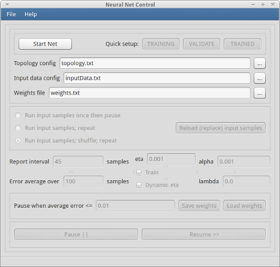
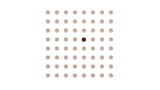
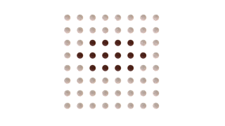

Neural2d - Neural Net Simulator
================================

User Manual
===========

Ver. 1.0

Features
--------

*     Optimized for 2D image data -- input data is read from .bmp image files
*     Neuron layers can be abstracted as 1D or 2D arrangements of neurons
*     Network topology is defined in a text file
*     Neurons in layers can be fully or sparsely connected
*     Selectable transfer function per layer
*     Adjustable or automatic training rate (eta)
*     Optional momentum (alpha) and regularization (lambda)
*     Standalone console program
*     Simple, heavily-commented code, < 2000 lines, suitable for prototyping, learning, and experimentation
*     Optional GUI controller
*     Tutorial video coming soon!

Document Contents
-----------------

[Requirements](#Requirements)  
[How to run the demo](#Demo)  
[GUI interface](#GUI)  
[How to use your own data](#YourOwnData)  
[The 2D in neural2d](#2D)  
[Topology config file format](#TopologyConfig)  
[Topology config file examples](#TopologyExamples)  
[How-do-I *X*?](#HowDoI)  
[Licenses](#Licenses)  

Also see the [wiki](https://github.com/davidrmiller/neural2d/wiki) for more information.

Requirements
------------

For the neural2d standalone console program:

* C++-11 compiler (e.g., g++ on Linux)
* Runs on Linux, Windows, and probably Mac

For neural2d-gui:

* Requires Python 3.x, and PyQt4  
* Requires xterm (Linux only)  
* Runs on Linux (Windows and Mac untested)

How to run the demo
-----------

Place all the files, maintaining the relative directory structure, into a convenient directory.

In the images/digits/ subdirectory, extract the image files from the archive into the same directory.

To compile neural2d, cd to the directory containing the Makefile and execute the default make target:

    make

If using MinGW on Windows, depending on how it's installed, you may need to use:

    mingw32-make

This will use g++ to compile neural2d.cpp and neural2d-core.cpp and result in an executable
named neural2d.

To run the demo, execute:

    make test

In this demo, we train the neural net to recognize digits.
The input data, or "training set", consists of a few thousand images of numeric digits. The
first 50 look like this:

The images are 32x32 pixels each, stored in .bmp format.
In this demo, the neural net is configured to have 32x32 input neurons, and 10 output neurons. 
The net is trained to classify the
digits in the images and to indicate the answer by driving the corresponding output neuron to
a high level.

Once the net is sufficiently trained, all the connection weights are saved in a file
named "weights.txt".

GUI interface
-------------

The optional GUI is written in Python 3.x, and requires PyQt4.

To run the GUI controller, execute:

    neuron2d-gui.py

If you get an error complaining about the python interpreter, it's because line 1 of neuron2d-gui.py
contains the wrong path to your Python 3 interpreter. Either change line 1 or else run it by
invoking the python interpreter directly, as in:

    python neuron2d-gui.py

or:

    python3 neuron2d-gui.py

A GUI interface will appear that looks like:

Press Start Net to launch the neural2d program. You'll see a separate window appear that looks something like this:

The neural net is initialized at this point, and paused waiting for your command to resume.

Press Resume to start the neural net training. It will automatically pause when the
average error rate falls below a certain threshold. You now have a trained net.

How to use your own data
------------------------

You'll need to prepare a set of image files and two configuration files.
One config file (named inputData.txt by default) is a list of images to use
as inputs to the neural net. The other config file (named topology.txt by default) 
contains a specification of the neural
net topology (the number and arrangement of neurons and connections).

First, prepare your set of input images. They need to be in .bmp format, and all must have
the same dimensions. Put those in a convenient directory.

Next, prepare the input data config file, by default named "inputData.txt" but
can be named anything. It contains a list of the
input image filenames and the expected output values of the neural net's output neurons.
A typical file contains lines formatted like this:

    images/thumbnails/test-918.bmp -1 1 -1 -1 -1 -1 -1 -1 -1 -1
    images/thumbnails/test-919.bmp -1 -1 -1 -1 -1 -1 -1 -1 1 -1
    images/thumbnails/test-920.bmp -1 -1 -1 -1 -1 -1 1 -1 -1 -1
    images/thumbnails/test-921.bmp -1 -1 -1 -1 -1 1 -1 -1 -1 -1

Then prepare the network topology config file, by default named "topology.txt." It contains
lines that specify the number of layers, the number and arrangement of neurons in each layer,
and the way the neurons are connected. A complete description of the format can be found
in a later section. A typical topology config file looks something like this:

    input size 32x32  
    layer1 size 32x32 from input radius 8x8  
    layer2 size 16x16 from layer1  
    output size 1x10 from layer2  

Then run neuron2d-gui and experiment with the parameters until the net is adequately trained, then save
the weights in a file for later use.

Or execute the console program directly, specifying the topology, input data, and weights filenames, like this:

    neuron2d topology.txt inputData.txt weights.txt

The weights file will be written with the network connection weights after the net has
been successfully trained.

If you run the GUI program, you can change the network parameters from the GUI while the
neural2d program is running. If you run the
neural2d console program directly, there is no way to interact with it while running.
Instead, you'll need to examine and modify the parameters in the code at the top of
the files neural2d.cpp and neural2d-core.cpp.

The 2D in neural2d
------------------

In a simple traditional neural net model, the neurons are arranged in a column in each layer:

In neural2d, you can specify a rectangular arrangement of neurons in each layer, such as:

The neurons can be sparsely connected to mimic how retinal neurons are connected in biological brains.
For example, if a radius of "1x1" is specified in the topology config file,
each neuron on the right (destination) layer will connect to a circular patch
of neurons in the left (source) layer as shown here (only a single neuron on the right side is shown connected
in this picture so you can see what's going on, but imagine all of them connected in the same pattern):

The pattern that is projected onto the source layer is elliptical. Here are some projected
connection patterns for various radii:

radius 0x0   

radius 1x1   

radius 2x2   

radius 3x1   

Topology config file format
---------------------------

The topology config file contains lines of the following format:

> *layer-definition-line* := *layer-name* size *size-spec* [from *layer-name*] [channel *channel-name*] [radius *size-spec*] [tf *transfer-function*]

where

 > *layer-name* := "input", "output", or a string that begins with "layer"
    
 > *size-spec* := *integer* ["x" *integer*]
 
 > *channel-name* := R, G, B, or BW
    
 > *transfer-function* := "tanh", "logistic", "linear", "ramp", or "gaussian"

Rules:

1. Comment lines that begin with "#" and blank lines are ignored.

1. The first layer defined must be named "input".

1. The last layer defined must be named "output".

1. The hidden layers can be named anything beginning with "layer".

1. The argument for "from" must be a layer already defined.

1. The color channel parameter can be specified only on the input layer.

1. The same layer name can be defined multiple times with different "from" parameters.
This allows source neurons from more than one layer to be combined in one 
destination layer. The source layers can be any size.
When a destination layer is defined more than once, each line must have 
an identical size parameter. In the following example, layerCombined appears twice
with the same size:

     input size 128x128  
     layerVertical size 32x32 from input radius 1x8  
     layerHorizontal size 16x16 from input radius 8x1  
     **layerCombined** size **8x8** from layerVertical   
     **layerCombined**  size **8x8** from layerHorizontal  
     output size 1 from layerCombined  

1. The *size-spec* can specify two dimensions, or one. Spaces are not allowed in the size spec. 
If only one dimension is given, the other is assumed to be 1. For example:

 * "8x8" means 64 neurons in an 8 x 8 arrangement.  
 * "8x1" means a row of 8 neurons
 * "1x8" means a column of 8 neurons.  
 * "8" means the same as "8x1"  

Topology config file examples
-----------------------------

Here are a few complete topology config files and the nets they specify.

    input size 4x4
    layer1 size 3x3 from input
    layer2 size 2x2 from layer1
    output size 1 from layer2

    input size 4x4
    layer1 size 1x4 from input
    layer2 size 3x1 from layer1
    output size 1 from layer2

    input size 4x4
    output size 4x1 from input radius 0x2

    input size 16x16
    layer1 size 4x4 from input radius 1x1
    output size 7x1 from layer1

    # In the picture that follows, layerVertical is the set of 4 neurons
    # in the upper part of the picture, and layerHorizontal is the lower
    # set of 4 neurons.
    
    input size 6x6
    layerHorizontal size 2x2 from input radius 2x0
    layerVertical size 2x2 from input radius 0x2
    output size 1 from layerHorizontal
    output size 1 from layerVertical

    # This example shows how vertical and horizontal image features can be
    # extracted through separate paths and combined in a subsequent layer.

    input size 4x4

    layerH1 size 1x4 from input radius 4x0
    layerH2 size 1x4 from layerH1
    layerH3 size 1x4 from layerH2

    layerV1 size 4x1 from input radius 0x4
    layerV2 size 4x1 from layerV1
    layerV3 size 4x1 from layerV2

    output size 2 from layerV3
    output size 2 from layerH3

How-do-I X?
-------------

**How do I get, build, and install the command-line neural2d program?**

Get the files from:

    https://github.com/davidrmiller/neural2d

Put those into a directory. Expand the images files in the images/digits/ subdirectory. In the top level
directory (where the Makefile lives), build the program with:

     make

That will produce an executable named neuron2d in the same directory.

To test the installation, run:

     make test

If it succeeds, it will create a weights.txt file of non-zero size.

**How do I run the command-line program?**

     ./neural2d topology.txt inputData.txt weights.txt

**How do I run the GUI interface?**

If you have Python 3.x and PyQt4 installed, then one of the following should work:

     ./neural2d-gui.py
     python neural2d-gui.py
     python3 neural2d-gui.py

**How do I use my own data instead of the digits images?**

Create your own directory of BMP images, and a config file that follows the same format as
shown in the provided default inputData.txt. Then define a topology config file with the
appropriate number of network inputs and outputs, then run the neural2d program.

**How do I use a trained net on new data?**

It's all about the weights file. After the net has been successfully trained, save 
the internal connection weights in a weights file.
That's typically done in neural2d.cpp by calling the member function saveWeights(filename).

The weights you saved can be loaded back into a neural net of the same topology using
the member function loadWeights(filename). Once the net has been loaded with weights,
it can be used applied to new data by calling feedForward(). Prior to calling
feedForward(), you'll want to set a couple of parameters:

     repeatInputSamples = false;
     reportEveryNth = 1;

This is normally done in neural2d.cpp.

You'll need to prepare a new input data config file (default name inputData.txt)
that contains a list of only those new input data images that you want the net to
process.

**How do I change the learning rate parameter?**

In the command-line program, you can set the eta parameter or change it by directly
setting the eta member of the Net object, like this:

     eta = 0.1;

When using neuron2d-gui, you can change the eta parameter (and other parameters)
in the GUI at any time, even while the network is busy processing input data.

Also see the [Parameter List](https://github.com/davidrmiller/neural2d/wiki/ParameterList)
in the wiki.

**Are the output neurons binary or floating point?**

They are whatever you train them to be, but you can only train the outputs to take
values in the range that the transfer function is capable of producing.

If you're training a net to output binary values,
it's best if you use the maxima of the transfer function to represent the two binary values.
For example, when using the default tanh() transfer function, train the outputs to
be -1 and +1 for false and true. When using the logistic transfer function, train the
outputs to be 0 and 1.

**How do I use a different transfer function?**

You can add a "tf" parameter to any layer definition line in the topology config file.
The argument to tf can be "tanh", "logistic", "linear", "ramp", or "gaussian". 
The transfer function you specify will be used by all the neurons in that layer.
See neural2d-core.cpp for more information.

In the topology config file, the tf parameter
is specified as in this example:

     layerHidden1 size 64x64 from input radius 3x3 tf linear

You can add new transfer functions by following the examples in neural2d-core.cpp.
There are two places to change: first find where transferFunctionTanh() is defined
and add your new transfer function and its derivative there. Next, locate the constructor
for class Neuron and add a new else-if clause there, following the examples.

**How do the color image pixels get converted to floating point for the input layer?**

That's in the ReadBMP() function in neural2d-core.cpp. The default version of ReadBMP()
converts each RBG pixel to a single floating point value in the range 0.0 to 1.0.

By default, the RGB color pixels are converted to monochrome and normalized to the
range 0.0 to 1.0. That can be changed at runtime by setting the colorChannel
member of the Net object to R, G, B, or BW prior to calling feedForward().
E.g., to use only the green color channel of the images, use:

    myNet.colorChannel = NNet::G;

The color conversion can also be specified in the topology config file on the
line that defines the input layer by setting the "channel" parameter to R, G, B, or BW, e.g.:

    input size 64x64 channel G

**Why does the net error rate stay high? Why doesn't my net learn?**

Neural nets are finicky. Try different network topologies. Try starting with a larger
eta values and reduce it incrementally. It could also be due to redundancy in the input data, 
or mislabeled target output values. Or you may need more training samples.

**What other parameters do I need to know about?**

Check out the [list of parameters in the wiki(https://github.com/davidrmiller/neural2d/wiki/ParameterList).

Licenses
--------

The neural2d program and its documentation are copyrighted and licensed under the terms of the MIT license.

The set of digits images in the images/digits/ subdirectory are released to the public domain.

